# Tableau → Sigma

Convert a Tableau **datasource or workbook** into a governed **Sigma data model** and a matching
**Sigma dashboard** — discovery, calc-field translation, data-model + workbook creation via the
Sigma REST API, layout generation, and **hard-gated parity verification**. The agent supplies the
judgment (which model shape, which calc translation, which layout); the `scripts/*` do the
mechanical work.

This plugin ships two skills:

| Skill | Role |
|---|---|
| **`tableau-assessment`** | *Upstream — Discover the estate.* Inventory a Tableau site, score complexity, and produce a value/cost-ranked migration shortlist. |
| **`tableau-to-sigma`** | *This skill — convert one workbook end to end.* Everything diagrammed below. |

---

## The migration journey

Four audience-facing stages — **Discover · Preserve · Rebuild · Verify/Cutover** — map onto the
skill's mechanical phases (`0a`→`6`). "Preserve" is cross-cutting: the converter translates business
logic faithfully **and flags what it can't safely translate instead of faking it**, and Phase 6
proves the numbers still match the source.

```mermaid
flowchart TB
    TAB["🟦 <b>Tableau Cloud</b><br/><i>workbook · .twb XML · VizQL view data · Metadata GraphQL</i>"]

    subgraph DISCOVER["1 · DISCOVER — inventory & plan"]
        direction TB
        P0a["<b>0a · Gap scan</b> (mandatory)<br/>scan-workbook-gaps.rb → gaps.json<br/>✅ auto · ⚠️ hint · 🛠 manual · ❌ unhandled"]
        SCOUT["<b>0a-scout</b> — resolve ❌ gaps (subagent)<br/>gap-scout.md · validate-sigma-formula.rb<br/>scout-validate-and-persist.rb · learned-rules.rb · escalate-gap.py"]
        P0b["<b>0b · Pick mode</b> (ask)<br/>mechanical ↔ dashboard-fidelity"]
        P0c["<b>0 / 0c · Cost + house style</b><br/>estimate-cost.rb · scan-customer-style.rb"]
        P1["<b>1 · Discover Tableau</b><br/>tableau-discover.rb · fetch-view-data.rb<br/>parse-twb-layout.rb · extract-calc-fields.rb · extract-custom-sql.rb"]
        P15["<b>1.5 · Reuse an existing DM?</b><br/>find-or-pick-dm.rb · inspect-dm-shape.rb<br/><i>(a match skips Phases 2–3)</i>"]
        P0a -->|"❌ unhandled"| SCOUT --> P0b
        P0a -->|"clean"| P0b --> P0c --> P1 --> P15
    end

    subgraph PRESERVE["2 · PRESERVE — translate, never fake"]
        CONV["<b>Sigma data-model converter</b><br/>convert_tableau_to_sigma (MCP)<br/>calc fields · LODs · table calcs · formats → Sigma formulas<br/>⚠ flags computed-key joins · cross-element metrics · FIXED LODs"]
    end

    subgraph REBUILD["3 · REBUILD — build the model + dashboard"]
        direction TB
        SRCQ{"Source = a LIVE<br/>warehouse connection?"}
        VDS["<b>Land it in the warehouse FIRST</b> — sibling skill<br/><b>tableau-vds-to-cdw</b><br/>.tds / .hyper / published VDS → warehouse DDL + load<br/>+ a Sigma DM on the landed table"]
        P2["<b>2 · Warehouse columns</b><br/>discover-warehouse-columns.rb · discover-columns.rb<br/>probe-custom-sql-columns.rb"]
        P25["<b>2.5 · View-level filters</b><br/>fetch-view-data.rb (distinct-value diff)"]
        P3["<b>3 · Build data-model spec</b><br/>refs/data-model-spec.md · validate-spec.rb"]
        P4["<b>4 · POST data model</b><br/>post-and-readback.rb (column-type guard)"]
        P5["<b>5 · Build workbook + layout</b><br/>build-charts-from-signals.rb · build-dashboard-layout.rb<br/>put-layout.rb · remap-wb-spec-to-dm-ids.rb · validate-spec.rb"]
        SRCQ -->|"file · .hyper · extract · published VDS"| VDS --> P2
        SRCQ -->|"live connection"| P2
        P2 --> P25 --> P3 --> P4 --> P5
    end

    subgraph VERIFY["4 · VERIFY / CUTOVER — prove parity, then switch"]
        direction TB
        P6["<b>6 · Parity check — HARD GATE</b><br/>auto-parity-plan.rb · verify-parity.rb · export-chart-png.rb<br/>assert-phase6-ran.rb (3 gates) · cleanup-orphan-workbooks.rb"]
        CUT["✅ <b>Cutover</b> — retire Tableau, move to Sigma with confidence"]
        P6 --> CUT
    end

    SIG["🟩 <b>Sigma</b><br/><i>data model + workbook via REST · warehouse via connection</i>"]
    WH[("⛁ Warehouse<br/>Snowflake · BigQuery · Databricks · Postgres …")]

    TAB --> P0a
    P1 -. "calc fields / datasource XML" .-> CONV
    CONV -. "Sigma formulas + ⚠ warnings" .-> P3
    P15 ==> SRCQ
    VDS -. "lands table" .-> WH
    P4 ==> SIG
    P5 ==> SIG
    SIG --- WH
    P6 -. "live parity queries (sigma-mcp-v2)" .-> SIG
```



> If the diagram doesn't render, your viewer lacks Mermaid support — the same phase → tool mapping is
> in the table below.

---

## Phases & tools

| Phase | What it does | Tools / scripts |
|---|---|---|
| **0a — Gap scan** *(mandatory, first)* | Scan the `.twb` and categorise every feature ✅ auto / ⚠️ hint / 🛠 manual / ❌ unhandled | `scan-workbook-gaps.rb` |
| **0a-scout** | One subagent per ❌ gap: propose a Sigma equivalent, validate it live, persist the rule (or flag it) | `gap-scout.md`, `validate-sigma-formula.rb`, `scout-validate-and-persist.rb`, `learned-rules.rb`, `escalate-gap.py` |
| **0b — Pick mode** | Choose **mechanical** (fast, structural) vs **dashboard-fidelity** (pixel layout) — ask the user | *(judgment)* |
| **0 / 0c — Cost & style** | Predict token cost; sample the org's workbooks for house style | `estimate-cost.rb`, `scan-customer-style.rb` |
| **1 — Discover Tableau** | Pull workbook + views + VizQL data + Metadata GraphQL + `.twb` XML; parse the dashboard zone tree; extract calc fields & Custom SQL | `tableau-discover.rb`, `fetch-view-data.rb`, `parse-twb-layout.rb`, `extract-calc-fields.rb`, `extract-custom-sql.rb`, `get-tableau-token.sh` · **Tableau MCP + REST** |
| **— Translate** | Rewrite calc fields, LODs, table calcs, and formats into Sigma formulas; **flag** what can't be mechanized | **`convert_tableau_to_sigma`** (Sigma data-model converter, MCP) |
| **1.5 — Reuse a DM** | Find an existing Sigma DM that already covers the columns; emit a denormalization plan (a match skips Phases 2–3) | `find-or-pick-dm.rb`, `inspect-dm-shape.rb` |
| **— Land data first** *(branch)* | If the datasource is **not a live warehouse connection** (file-based `.hyper`/Excel/CSV, or a published extract / VDS), materialize it in the warehouse first, then convert the workbook on the landed table | **`tableau-vds-to-cdw`** *(sibling skill)* — `.tds` → warehouse DDL + load + Sigma DM |
| **2 — Warehouse columns** | Resolve real warehouse column names/types; probe via Custom-SQL when the catalog 404s | `discover-warehouse-columns.rb`, `discover-columns.rb`, `probe-custom-sql-columns.rb` · **Sigma REST** |
| **2.5 — View filters** | Detect view-level filters by diffing view-CSV distinct values vs. the warehouse | `fetch-view-data.rb` |
| **3 — Build data model** | Assemble the DM spec (sources, calc columns, relationships) and validate it | `refs/data-model-spec.md`, `validate-spec.rb` |
| **4 — POST data model** | Create the DM and read back element IDs; abort on any `type=error` column | `post-and-readback.rb`, `get-token.sh` · **Sigma REST** (`/v2/dataModels/spec`) |
| **5 — Build workbook** | Generate chart specs from the parsed layout + signals, build the grid layout, post the workbook, apply the layout | `build-charts-from-signals.rb`, `build-dashboard-layout.rb`, `put-layout.rb`, `remap-wb-spec-to-dm-ids.rb`, `validate-spec.rb` · **Sigma REST** (`/v2/workbooks/spec`) |
| **6 — Verify parity** *(hard gate)* | Diff Sigma vs. Tableau per chart (values + PNG visuals), clean up orphan workbooks, and **block completion** unless parity passes, no orphans remain, and no live `type=error` columns exist | `auto-parity-plan.rb`, `verify-parity.rb`, `export-chart-png.rb`, `assert-phase6-ran.rb`, `cleanup-orphan-workbooks.rb` · **Sigma MCP (sigma-mcp-v2)** |

---

## Toolchain

- **Tableau Cloud** — Tableau MCP (read) + REST/PAT (`get-tableau-token.sh`, `lib/tableau_rest.rb`) + Metadata GraphQL + the raw `.twb` XML.
- **Sigma data-model converter** — `convert_tableau_to_sigma` (MCP): translates calc fields / LODs / table calcs / number formats into Sigma formulas and **flags, never fakes** what it can't safely convert.
- **Sigma REST API** (`get-token.sh` → `SIGMA_API_TOKEN`, ~1h TTL) — `/v2/dataModels/spec`, `/v2/workbooks/spec`, `/v2/connections/tables/{inodeId}/columns`, `/v2/files/{id}`, `/v2/workbooks/{id}/export`.
- **Sigma MCP** (`sigma-mcp-v2`) — live parity queries in Phase 6.
- **Warehouse** — Snowflake / BigQuery / Databricks / Postgres / SQL Server / Redshift / Synapse / Oracle, reached **through the Sigma connection** (the conversion is warehouse-agnostic).
- **`tableau-vds-to-cdw`** *(sibling skill)* — for datasources that aren't a live warehouse connection (file-based extracts / published VDS): generates warehouse DDL, loads the data, and builds a Sigma DM on the landed table so the workbook has something to convert against. The `tableau-assessment` skill flags these as `recommended_path: vds-to-snowflake`.

---

## Quickstart

```bash
ruby scripts/setup.rb            # one-time Sigma credentials  → SIGMA_CLIENT_ID / SECRET
ruby scripts/setup-tableau.rb    # one-time Tableau PAT (PAT mode)
```

Then invoke the **`tableau-to-sigma`** skill with a Tableau workbook/datasource (or its URL) and it
runs the phases above. See `skills/tableau-to-sigma/QUICKSTART.md` for a runnable walkthrough and
`skills/tableau-to-sigma/SKILL.md` for the full phase reference. Read the `refs/` first:
`column-gotchas.md`, `data-model-spec.md`, `workbook-layout.md`.

> **Canonical workbook spec shape** (element kinds, controls, formulas, formatting) lives in the
> companion **`sigma-workbooks`** skill — this skill restates only the Tableau-conversion-specific
> patterns.
